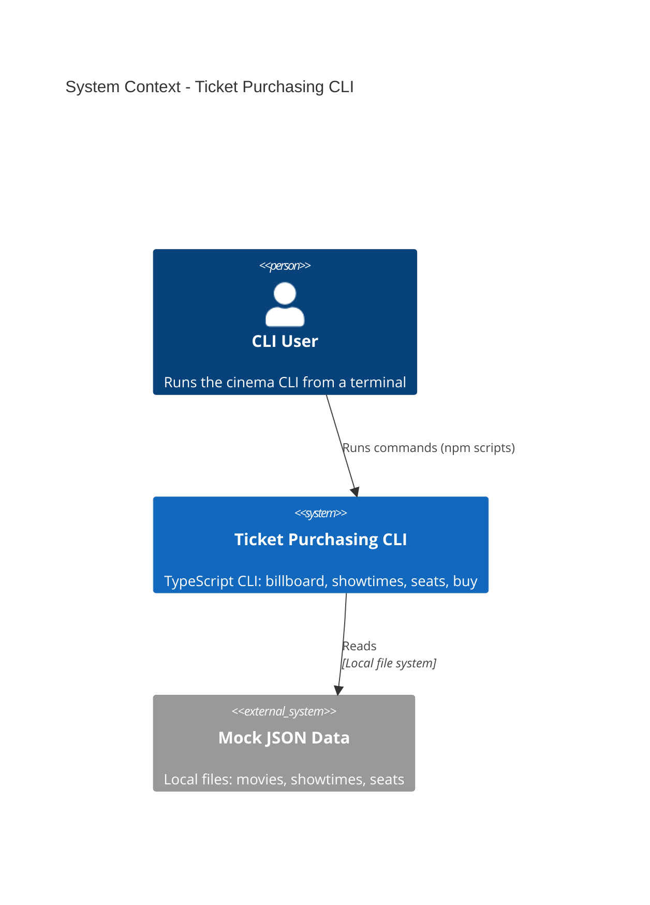

# Ticket Purchasing - System Context

## System Overview

A single, local, framework-free TypeScript CLI that runs a complete cinema ticket-purchasing flow against mock JSON data. There is no server, database, or external service: the CLI reads mock data from local JSON files, runs pure domain logic (pricing, seat validation, Tuesday discount, confirmation generation), and prints results to the console. The system exists to exercise the specsmd AI-DLC methodology identically across Claude Code, Codex, and Kiro.

## Context Diagram

## External Integrations

- **Mock JSON Data (local files)**: Source of movies, showtimes, and seat layouts/availability. Read-only; bundled in the repo for deterministic runs.
- _No_ external APIs, payment gateways, auth providers, or databases (explicit non-goals).

## High-Level Constraints

- Must run locally via npm scripts; no network access required.
- Domain logic must be pure (no Commander.js, no `console`, no file I/O); the command layer owns parsing, console output, and user-facing errors.
- Deterministic: same inputs + unchanged data → identical output (clock injectable for the Tuesday rule).

## Key NFR Goals

- TypeScript strict mode; domain logic unit-tested with Vitest.
- Small, comparable scope across Claude Code, Codex, and Kiro.
- Clear, user-facing error messages with non-zero exit codes on failure.
