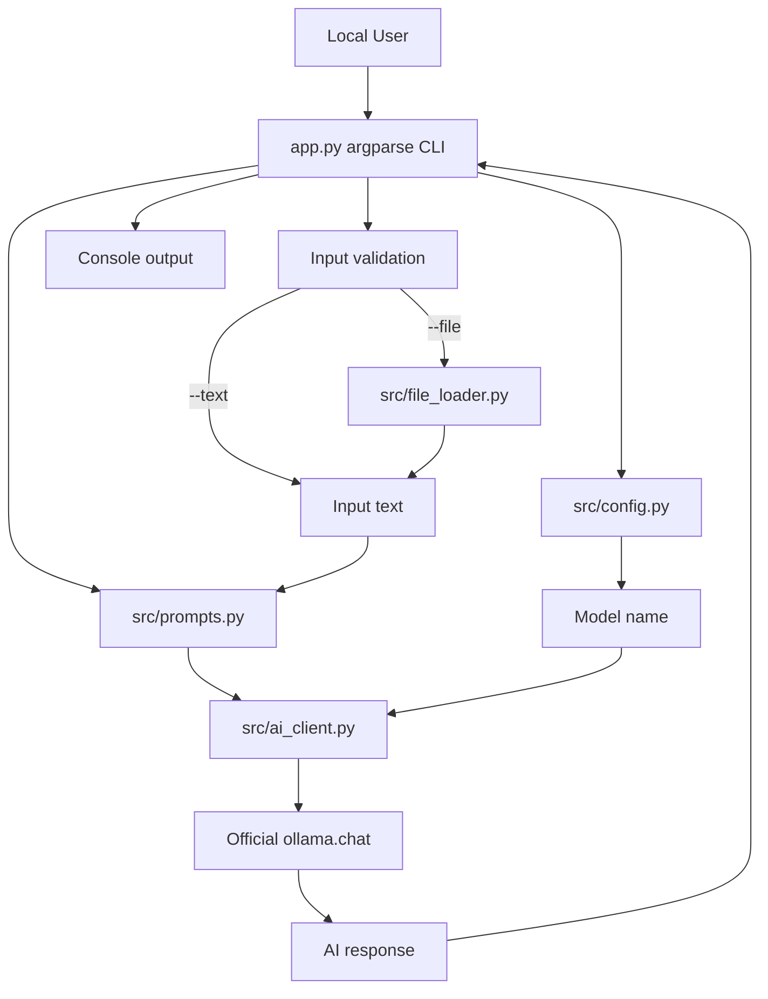

# LocalNote AI Design Document

## Overview

LocalNote AI is a small Python 3.11 console application built around `argparse` subcommands. The code uses a straightforward module layout: `app.py` handles command-line parsing and orchestration, `src/config.py` loads environment configuration, `src/file_loader.py` reads local text files, `src/prompts.py` builds task-specific prompts, and `src/ai_client.py` contains the only direct Ollama call.

The application is intentionally local-first. It stores no remote data, uses no web framework, does not connect to external APIs, and delegates AI processing only to the official `ollama` Python package. The model name is read from `OLLAMA_MODEL` with a single default of `minimax-m3:cloud`.

## Architecture



**Key Architectural Principles:**

- Keep command parsing separate from AI access.
- Keep prompt construction deterministic and easy to test.
- Keep local file access explicit and limited to UTF-8 text reads.
- Keep configuration centralized so the default model is defined once.

## Flow of Data

1. The user runs `python app.py <command>` with either `--text` or `--file`.
2. `app.py` validates common input requirements and command-specific requirements.
3. If `--file` is provided, `src/file_loader.py` reads the file as UTF-8 text.
4. `app.py` selects the matching function from `src/prompts.py`.
5. `src/config.py` loads `.env` values with `python-dotenv` and returns the selected Ollama model.
6. `src/ai_client.py` calls:

```python
from ollama import chat

response = chat(
    model='minimax-m3:cloud',
    messages=[{'role': 'user', 'content': 'Hello!'}],
)

print(response.message.content)
```

7. The returned message content is printed to stdout.
8. Expected user-facing errors are printed clearly without unnecessary stack traces.

## Components and Interfaces

### `app.py` Module

Responsible for CLI parsing, input selection, prompt dispatch, and user-facing output.

**Key Methods:**

- `build_parser() -> argparse.ArgumentParser` - Creates the CLI parser and subcommands.
- `resolve_input(args: argparse.Namespace, parser: argparse.ArgumentParser) -> str` - Resolves `--text` or `--file` into Input_Text.
- `build_prompt(command: str, text: str, question: str | None) -> str` - Selects the correct Prompt_Builder.
- `main(argv: list[str] | None = None) -> int` - Runs the command and returns an exit code.

### `src/config.py` Module

Responsible for loading local configuration.

**Key Methods:**

- `get_model_name() -> str` - Loads `.env`, reads `OLLAMA_MODEL`, and returns `minimax-m3:cloud` when unset or blank.

### `src/file_loader.py` Module

Responsible for reading local text files.

**Key Methods:**

- `load_text_file(path: str | Path) -> str` - Reads a local file as UTF-8 and returns the text.

### `src/prompts.py` Module

Responsible for deterministic prompt generation.

**Key Methods:**

- `summarize_prompt(text: str) -> str` - Builds a summarization prompt.
- `tasks_prompt(text: str) -> str` - Builds a pending-task extraction prompt.
- `clean_prompt(text: str) -> str` - Builds an organization prompt.
- `professional_prompt(text: str) -> str` - Builds a professional-response prompt.
- `ask_prompt(text: str, question: str) -> str` - Builds a context-aware question prompt.

### `src/ai_client.py` Module

Responsible for encapsulating the Ollama request.

**Key Methods:**

- `run_chat(prompt: str, model: str) -> str` - Calls `ollama.chat` and returns `response.message.content`.

## Data Models

### CLI Request

```typescript
interface CliRequest {
  command: "summarize" | "tasks" | "clean" | "professional" | "ask";
  text?: string;      // Non-empty when --text is used
  file?: string;      // Local path when --file is used
  question?: string;  // Required and non-empty for ask
}
```

**Validation Rules:**

- `command`: Must be one of the supported subcommands.
- `text`: Must be non-empty after trimming when provided.
- `file`: Must point to a readable UTF-8 local file when provided.
- `question`: Must be non-empty after trimming for `ask`.
- `text` and `file`: At least one must be provided.

### AI Request

```typescript
interface AiRequest {
  model: string;  // Defaults to minimax-m3:cloud
  messages: Array<{
    role: "user";
    content: string;
  }>;
}
```

**Validation Rules:**

- `model`: Read from `OLLAMA_MODEL` or defaulted in `src/config.py`.
- `messages`: Always contains exactly one user message for this application.
- `content`: Generated by one Prompt_Builder and must include the user text.

## Error Handling

### Input and File Errors

| Error Type | Condition | Recovery Strategy |
|------------|-----------|-------------------|
| MissingInputError | Neither `--text` nor `--file` is provided | Show argparse error explaining that one is required |
| EmptyInputError | Resolved input text is blank | Show argparse error explaining that input cannot be empty |
| MissingQuestionError | `ask` is run without `--question` | Show argparse error explaining that `--question` is required |
| EmptyQuestionError | `--question` is blank | Show argparse error explaining that question cannot be empty |
| FileNotFoundError | Local file path does not exist | Print a clear file error and return exit code 1 |
| UnicodeDecodeError | File cannot be decoded as UTF-8 | Print a clear UTF-8 file error and return exit code 1 |

### Ollama Errors

| Error Type | Condition | Recovery Strategy |
|------------|-----------|-------------------|
| OllamaRequestError | `ollama.chat` raises an exception | Print a concise message suggesting that Ollama and the configured model should be checked |
| EmptyResponseError | Ollama returns no content | Print a concise message that no response was returned |

### Recovery Strategies

- **No automatic retry**: Keep behavior predictable and simple.
- **Fail fast for validation**: Validate text and question before contacting Ollama.
- **User notification**: Print clear messages to stderr for expected failures.
- **No stack traces for expected errors**: Return non-zero exit codes instead.

## Testing Strategy

### Unit Tests

- `src/file_loader.py`: Verify successful UTF-8 reading, missing file behavior, and invalid UTF-8 behavior.
- `src/prompts.py`: Verify each prompt includes the input text, uses the expected intent, and the `ask` prompt includes the question.

### Integration-Oriented Checks

- CLI argument validation can be manually checked with the documented example commands.
- Ollama integration can be manually checked after Ollama is running and the configured model is available.

### Test Organization

- Test file naming: `test_*.py`
- Location: `tests/`
- Framework: `pytest`

## Technical Decisions

- Use `argparse` to avoid framework overhead and keep the app terminal-native.
- Use `python-dotenv` only for local configuration loading.
- Use the official `ollama` package as the only AI access path.
- Use plain functions instead of classes because the application state is minimal.
- Use UTF-8 for file loading to keep behavior portable across Windows, Linux, and macOS.
- Keep tests focused on deterministic modules to avoid requiring a running Ollama instance in automated tests.
