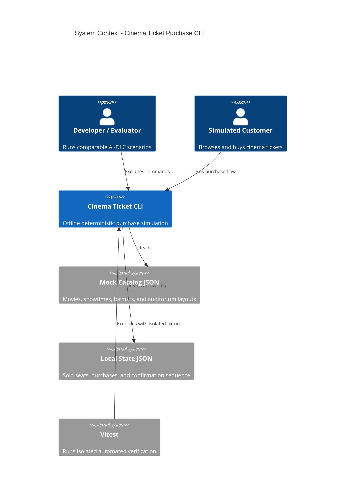

# Cinema Ticket Purchase - System Context

## System Overview

The Cinema Ticket CLI is an offline TypeScript application that lets an evaluator exercise a realistic ticket-purchase flow against deterministic JSON fixtures. It reads a mock cinema catalog, maintains purchase state locally, and exposes scriptable Commander.js commands plus optional guidance for purchasing.

## Actors

- **Developer/Evaluator** (primary human): Runs identical scenarios to compare Claude Code, Codex, and Kiro implementations.
- **Simulated Cinema Customer** (human role): Browses movies and showtimes, selects seats, and receives a purchase confirmation.
- **Test Runner** (system actor): Uses npm and Vitest with isolated fixtures to verify deterministic behavior.

## System Boundary

Inside the boundary are command parsing, use-case orchestration, pure cinema domain rules, JSON fixture reading, JSON state persistence, and confirmation rendering.

Outside the boundary are real cinemas, payments, authentication, databases, web interfaces, network services, and deployment infrastructure.

## Context Diagram

## External Integrations

There are no third-party or network integrations. Local files are boundary resources rather than remote systems.

- **Mock Catalog JSON**: Read-only movie, showtime, format, price, and seat-layout data.
- **Local State JSON**: Mutable sold-seat, purchase, and confirmation-sequence data.
- **Vitest fixtures**: Resettable catalog and state inputs owned by each test.

## Data Flows

### Inbound

- Command names, positional arguments, and options enter as terminal text and are validated at the CLI boundary.
- Catalog and state enter as UTF-8 JSON and are schema-validated before becoming domain values.

### Outbound

- Movie, showtime, seat, price, and confirmation views go to stdout in deterministic order.
- Actionable validation and persistence errors go to stderr with stable non-zero exit codes.
- Successful purchases atomically replace the local state JSON with the next valid state.

## High-Level Constraints

- Entirely offline and portable across Windows, macOS, and Linux.
- TypeScript, Commander.js, npm scripts, and Vitest are mandatory.
- Domain modules cannot import Commander.js or filesystem APIs.
- The MVP assumes a single writer process for each state file.

## Key NFR Goals

- Identical inputs produce equivalent observable behavior across agent implementations.
- Pricing and discount rules have complete branch coverage.
- Tests use independent temporary state and never depend on execution order.
- Failed or rejected purchases preserve the previous valid state.
