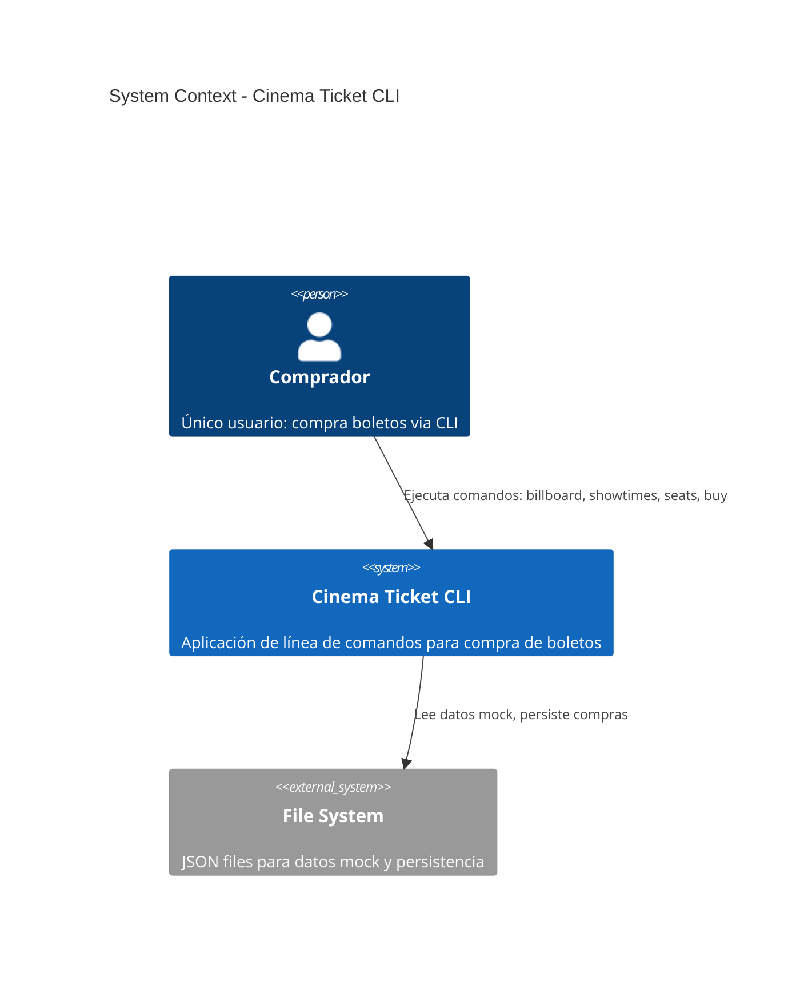

# Ticket Purchasing - System Context

## System Overview

CLI tool that allows a buyer to browse a cinema billboard, check showtimes, select seats, and complete a ticket purchase. All data is local (JSON files), no external integrations.

## Context Diagram

## Actors

- **Comprador** (Human): Único usuario del sistema. Ejecuta comandos CLI para navegar cartelera y comprar boletos.

## External Systems

- **File System** (Local): Lectura de datos mock (películas, funciones, asientos) y escritura de compras confirmadas. No es un sistema externo real, es el disco local.

## Data Flows

### Inbound
- Datos mock de películas, funciones y asientos (JSON estáticos)
- Parámetros de comando del usuario (película, función, asientos, nombre)

### Outbound
- Output en consola (cartelera, funciones, disponibilidad, confirmación)
- Archivo JSON de compras persistidas

## High-Level Constraints

- 100% offline, sin network
- Sin autenticación
- Single-user (sin concurrencia)
- Determinístico
- Cross-platform (Win/Mac/Linux)
